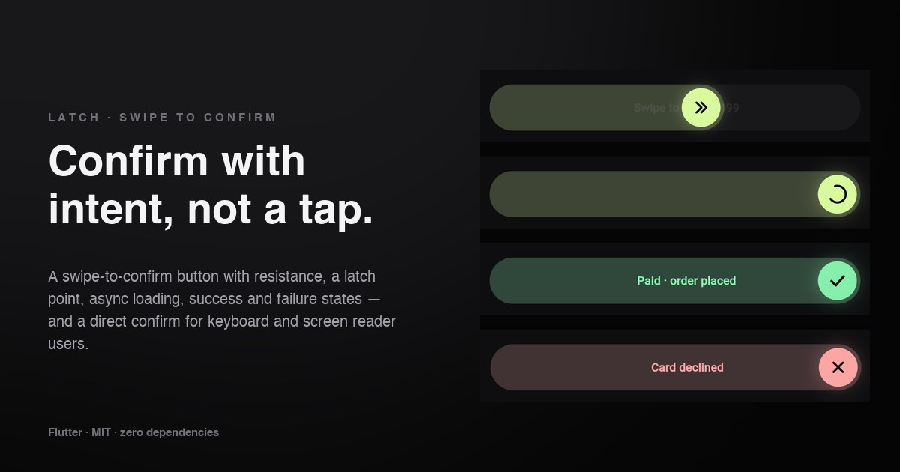

# Latch

A swipe-to-confirm button for Flutter. The thumb **resists at first**, gives a
**click at the latch point**, and only then runs your action — with a loading
spinner, a success state, or a **shake** and spring-back if it fails.

**[→ Live demo](https://yagnikbarasiya23.github.io/latch_swipe_confirm/)** (the example app, built for the web)



No dependencies beyond Flutter itself.

## Why

Payments, deletions and other one-way actions deserve more than a tap that a
pocket or a stray thumb can trigger. A swipe asks for intent. Latch makes
that swipe feel physical — and never makes it the *only* way: keyboard and
screen reader users confirm directly.

## Install

```yaml
dependencies:
  latch_swipe_confirm:
    git:
      url: https://github.com/YagnikBarasiya23/latch_swipe_confirm.git
```

Requires Flutter 3.47 or newer.

## Use it

```dart
import 'package:latch_swipe_confirm/latch_swipe_confirm.dart';

LatchSwipeConfirm(
  label: 'Swipe to pay ₹1,499',
  doneLabel: 'Paid',
  failedLabel: 'Card declined',
  onConfirm: () async {
    await payments.charge(order);   // throw, or return false, to fail
    return true;
  },
)
```

What happens:

1. **Dragging** — the first 12 % of the track eases in, so a brushed touch
   barely moves it. The label fades as the thumb covers it, and a fill trails
   behind the thumb.
2. **Release early** — the thumb springs back, keeping the speed you let go at.
3. **Past the latch point** (86 % by default, or a strong flick from halfway) —
   a haptic tick, the thumb springs home and `onConfirm` runs with a spinner.
4. **Success** — green fill, a check and `doneLabel`. Optionally resets after
   `resetAfter`.
5. **Failure** — a short shake, red fill, a cross and `failedLabel`, then
   back to the start.

### Properties

| Property | Default | |
| --- | --- | --- |
| `label` | required | Text on the track |
| `onConfirm` | required | `FutureOr<bool?> Function()`; throw or return `false` to fail |
| `doneLabel`, `failedLabel` | `'Done'`, `'Try again'` | Text after the result |
| `height` | `64` | Track height; the thumb is a circle inside it |
| `threshold` | `0.86` | Share of the track that latches — raise it for destructive actions |
| `enabled` | `true` | Disables dragging and activation |
| `resetAfter` | `null` | Go back to idle this long after success |
| `trackColor`, `fillColor`, `thumbColor`, `iconColor` | dark / lime | Idle colours |
| `doneColor`, `failedColor` | green / red | Result colours |
| `textStyle` | 16 px semibold | Label style |
| `icon` | double chevron | Thumb content while idle |
| `haptics` | `true` | Tick at the latch point, feedback on the result |
| `onStateChanged` | `null` | `idle`, `dragging`, `confirming`, `done`, `failed` |

## How it works

- **Three small functions.** `latchProgress()` turns the drag into a share of
  the travel, `latchResistance()` eases the first part of it with a
  smoothstep blend, and `shouldLatch()` decides on release — past the
  threshold, or at least halfway with a flick.
- **One unbounded controller** holds the thumb's position. Releases and
  resets run a `SpringSimulation` from the current position *and velocity*,
  so a thrown thumb keeps its momentum into the latch or back to the start.
- **The track is painted**: a rounded track, a fill that follows the thumb,
  and a focus ring. The thumb icons (chevron, spinner, check, cross) are tiny
  painters, so nothing depends on an icon font.
- **Async-safe.** The widget checks it's still mounted after `onConfirm`,
  treats a thrown error as a failure, and ignores drags while confirming or
  done.

## Accessibility

- It's a **button** in the semantics tree, labelled with the current text
  (“Swipe to pay ₹1,499”, “…, working”, “Paid”). Double-tapping with a screen
  reader confirms — no swipe needed. The drag gesture is kept out of
  semantics so it doesn't appear as a scroll action.
- It's focusable; <kbd>Enter</kbd> or <kbd>Space</kbd> confirms. A focus ring
  shows for keyboard focus only.
- With *reduce motion* enabled, the thumb jumps instead of springing and
  there is no shake or spinner rotation.

## Example app

```bash
cd example
flutter run            # any device — haptics are best on a real phone
flutter run -d chrome  # the web demo
```

A checkout that can be set to decline, and a red “delete account” track that
needs 94 % and resets itself.

## Tests

```bash
flutter test
```

Covers progress, resistance and latch maths, springing back from a short
drag, confirming with loading and success, thrown and `false` failures,
keyboard and screen reader activation, auto reset, and reduced motion.

## Licence

[MIT](LICENSE) © 2026 Yagnik Barasiya. Use it in personal and client work.

More components at [yagnikbarasiya.com/components](https://www.yagnikbarasiya.com/components).
